# Architecture Diagrams

## System Overview

### High-Level Architecture
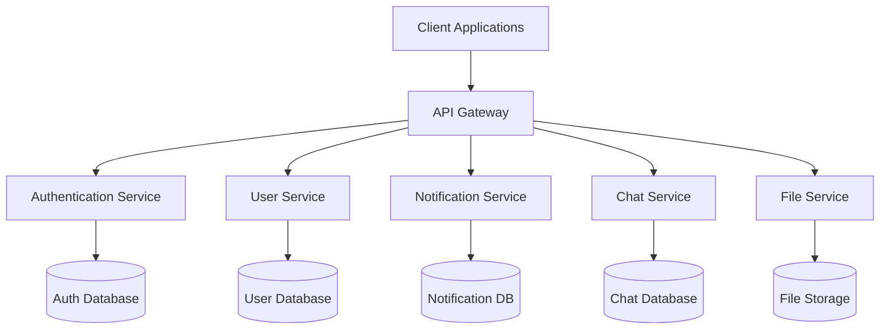

## Service Architecture

### Authentication Service
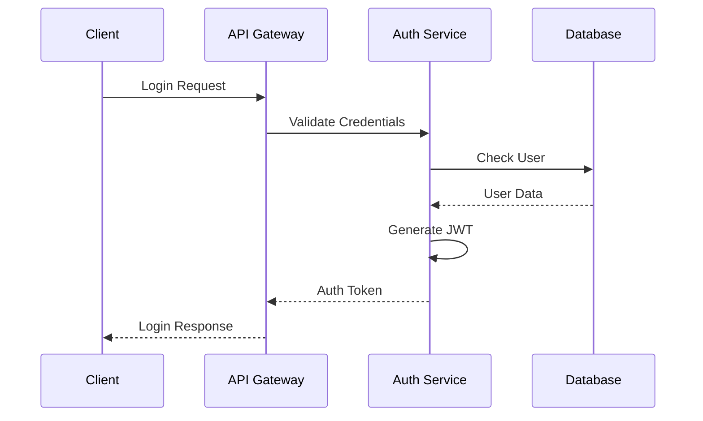

### User Management
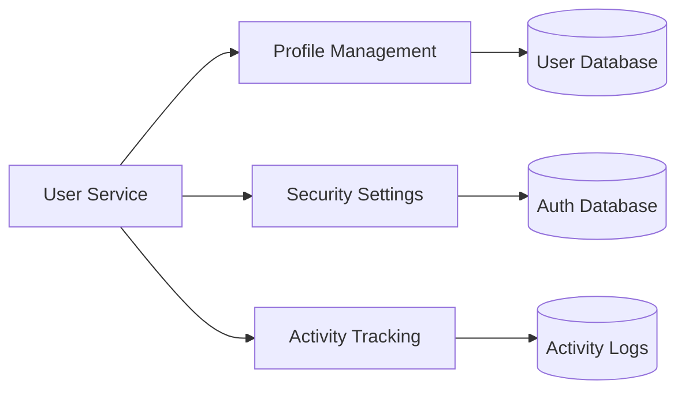

### Notification System
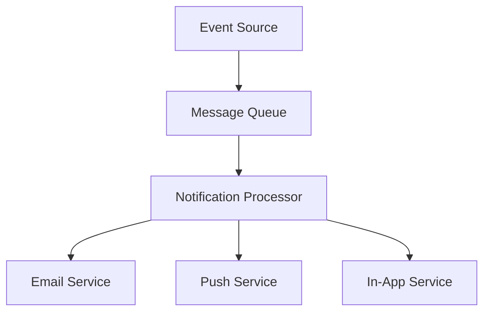

## Data Flow

### User Registration Flow
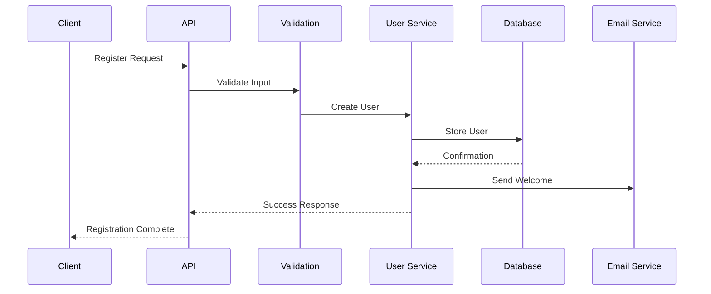

### File Upload Flow
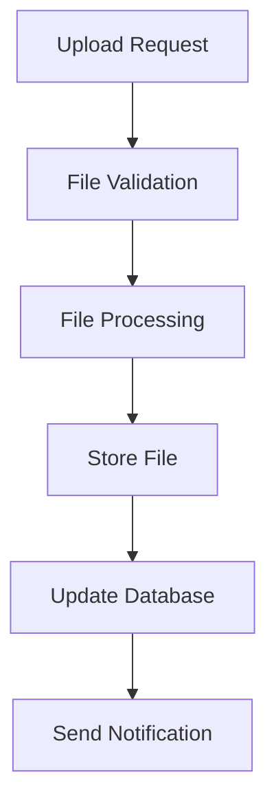

## Infrastructure

### Production Environment
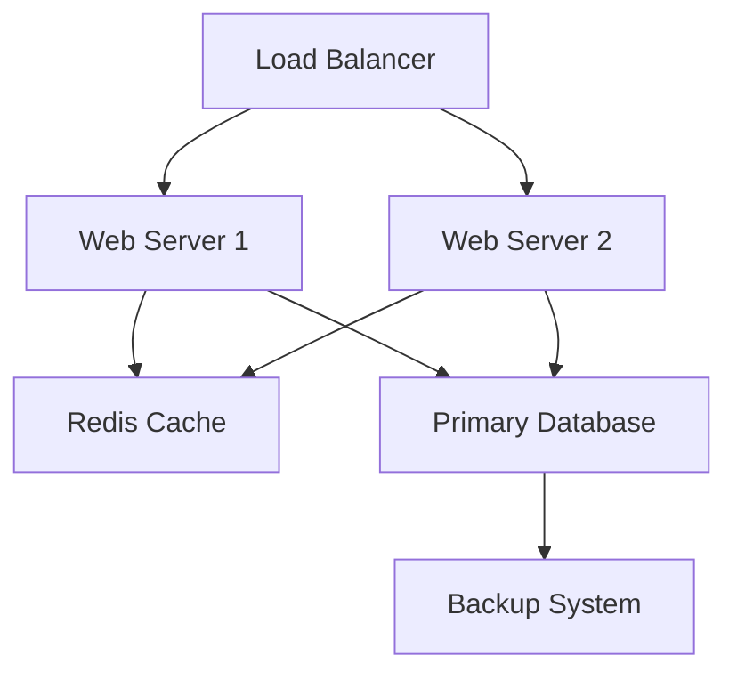

### Development Pipeline
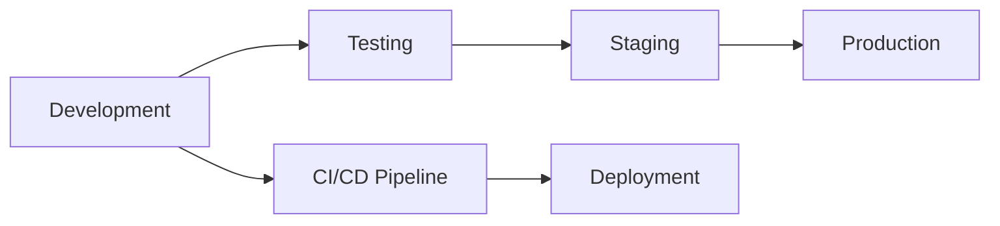

## Component Diagrams

### Frontend Architecture
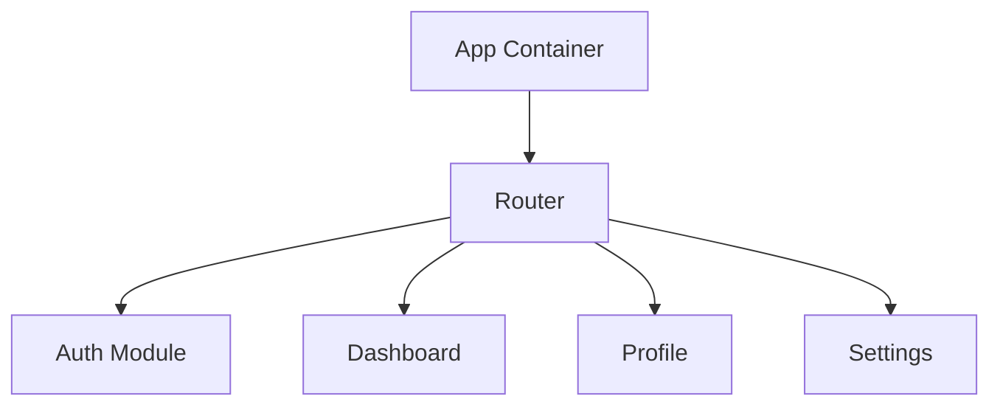

### Backend Architecture
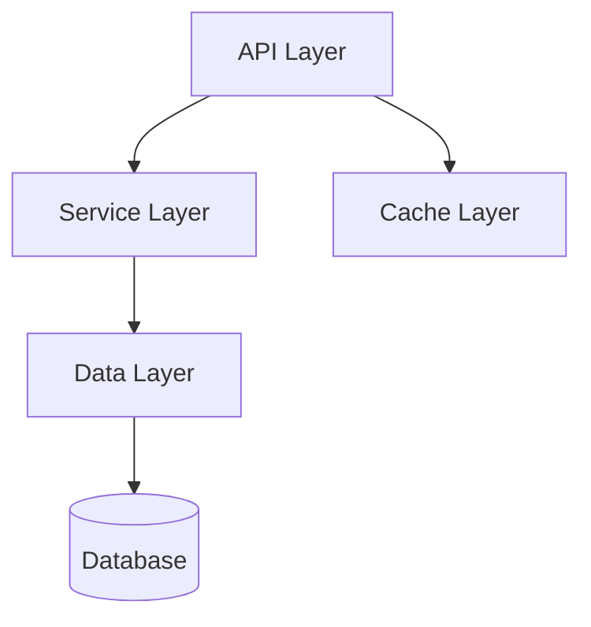

## Security Architecture

### Authentication Flow
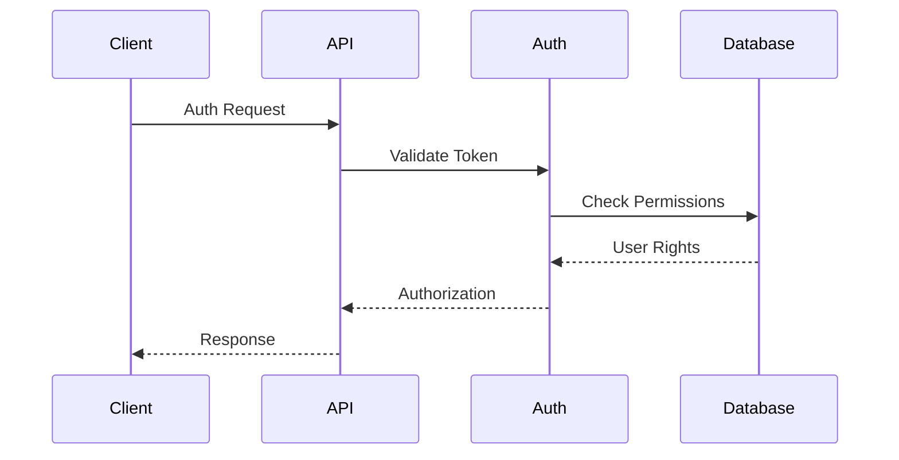

## Monitoring Setup

### Logging Architecture
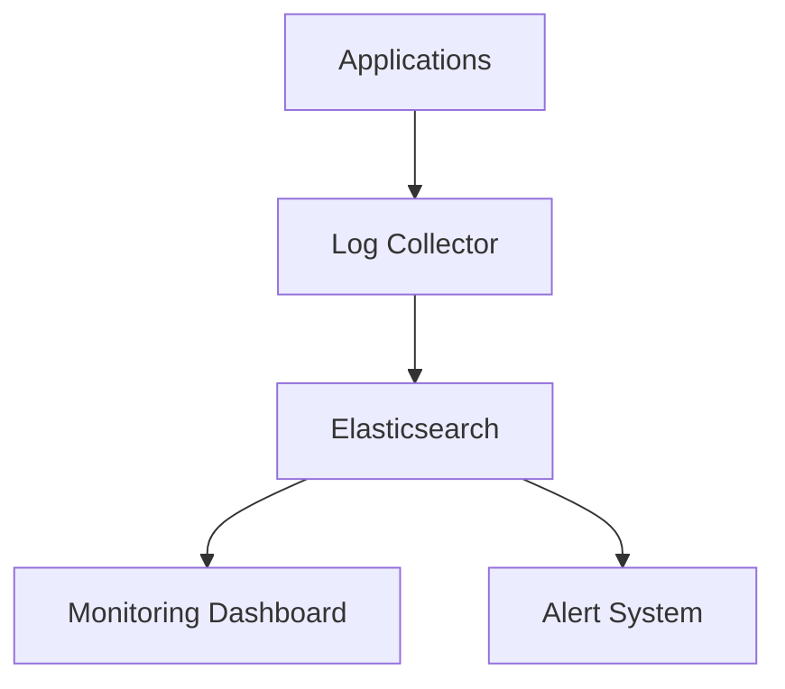

## Action Items

### High Priority
- [ ] Review and update service interactions
- [ ] Document new microservices
- [ ] Update security flow diagrams
- [ ] Create deployment architecture

### Medium Priority
- [ ] Add database schema diagrams
- [ ] Document API gateway patterns
- [ ] Create monitoring flowcharts
- [ ] Update cache architecture

### Low Priority
- [ ] Add development environment setup
- [ ] Document backup procedures
- [ ] Create recovery workflows
- [ ] Update testing architecture 