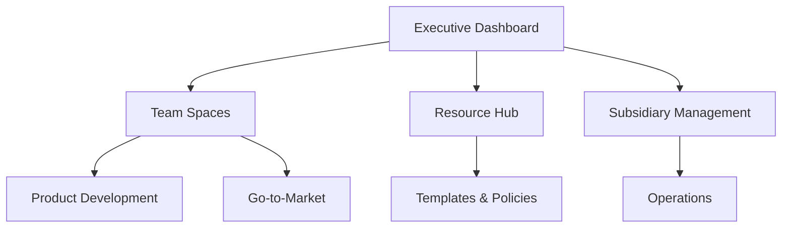

# Workspace Integration Guide

## Overview

### Purpose
This guide outlines how different sections of the workspace integrate and interact with each other, ensuring smooth information flow and cross-functional collaboration.

## Section Integrations

### Executive Dashboard Integration


#### Data Flow
1. **Metrics & KPIs**
   - Source: Team Spaces
   - Destination: Executive Dashboard
   - Update Frequency: Weekly
   - Integration Method: Automated rollup

2. **Project Status**
   - Source: Product Development
   - Destination: Executive Dashboard
   - Update Frequency: Daily
   - Integration Method: Project tracking

### Team Spaces Integration

#### Engineering & Product Management
1. **Sprint Planning**
   - Input: Product Roadmap
   - Output: Sprint Backlog
   - Sync Frequency: Bi-weekly
   - Integration Points: JIRA, GitHub

2. **Feature Development**
   - Input: Feature Requests
   - Output: Technical Specs
   - Sync Frequency: Continuous
   - Integration Points: Documentation

#### Product & Marketing
1. **Launch Planning**
   - Input: Product Roadmap
   - Output: Marketing Calendar
   - Sync Frequency: Monthly
   - Integration Points: Campaign tracking

2. **Content Strategy**
   - Input: Product Features
   - Output: Marketing Materials
   - Sync Frequency: Bi-weekly
   - Integration Points: Content calendar

## Cross-Functional Workflows

### Product Launch Process
1. **Planning Phase**
   ```
   Product Team → Engineering → Marketing → Sales
   ```
   - Documentation: Product specs
   - Handoffs: Technical requirements
   - Timeline: Launch schedule

2. **Development Phase**
   ```
   Engineering → QA → Product → Marketing
   ```
   - Documentation: Build status
   - Handoffs: Release notes
   - Timeline: Development milestones

3. **Launch Phase**
   ```
   Marketing → Sales → Customer Success → Support
   ```
   - Documentation: Launch materials
   - Handoffs: Customer communications
   - Timeline: Go-to-market schedule

## Document Relationships

### Template Dependencies
1. **Project Documents**
   - Project Brief → Technical Spec → Development Plan
   - Status Reports → Executive Summary → Board Updates
   - Feature Request → Product Spec → Engineering Tasks

2. **Process Documents**
   - Policy → Procedure → Work Instructions
   - Strategy → Tactics → Implementation Plans
   - Requirements → Design → Implementation

### Cross-Reference System
1. **Linking Convention**
   ```
   @section/subsection/document#heading
   ```
   Example: @team-spaces/engineering/tech-stack#infrastructure

2. **Version References**
   ```
   @document@version
   ```
   Example: @security-policy@v2.1

## Integration Tools

### Notion Features to Use
1. **Databases**
   - Project tracking
   - Resource management
   - Document library

2. **Relations**
   - Cross-database references
   - Linked records
   - Rollup fields

3. **Views**
   - Kanban boards
   - Calendar views
   - Timeline views

### Automation Setup
1. **Regular Updates**
   - Daily metrics rollup
   - Weekly status aggregation
   - Monthly report generation

2. **Notifications**
   - Due date reminders
   - Status changes
   - Mentions and comments

## Best Practices

### Document Management
1. **Naming Conventions**
   - Format: [Type]-[Department]-[Name]-[Version]
   - Example: POL-HR-Remote-Work-v1.2

2. **Version Control**
   - Major changes: Increment first number (v1.0 → v2.0)
   - Minor changes: Increment second number (v1.1 → v1.2)
   - Track changes in version history

### Access Control
1. **Permission Levels**
   - View only
   - Comment
   - Edit
   - Full access

2. **Group Management**
   - Department-based
   - Role-based
   - Project-based

## Maintenance

### Regular Reviews
1. **Documentation**
   - Monthly: Check for outdated content
   - Quarterly: Full content audit
   - Annually: Structure review

2. **Integration Points**
   - Weekly: Check automated workflows
   - Monthly: Verify cross-references
   - Quarterly: Update integration maps

### Updates
1. **Content Updates**
   - Assign section owners
   - Schedule regular reviews
   - Track change requests

2. **Structure Updates**
   - Monitor usage patterns
   - Gather user feedback
   - Implement improvements

## Version History

| Version | Date | Author | Changes |
|---------|------|--------|----------|
| 1.0 | [Date] | [Author] | Initial version |

---

**Last Updated**: [Date]
**Document Owner**: Operations Team
**Review Schedule**: Monthly 